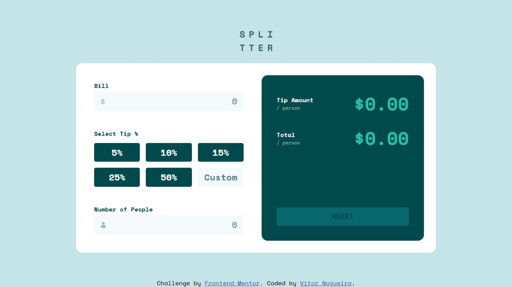

# Frontend Mentor - Tip calculator app solution

This is a solution to the [Tip calculator app challenge on Frontend Mentor](https://www.frontendmentor.io/challenges/tip-calculator-app-ugJNGbJUX). Frontend Mentor challenges help you improve your coding skills by building realistic projects.

## Table of contents

- [Overview](#overview)
  - [The challenge](#the-challenge)
  - [Screenshot](#screenshot)
  - [Links](#links)
- [My process](#my-process)
  - [Built with](#built-with)
  - [What I learned](#what-i-learned)
  - [Continued development](#continued-development)
  - [Useful resources](#useful-resources)
  - [AI Collaboration](#ai-collaboration)
- [Author](#author)
- [Acknowledgments](#acknowledgments)

## Overview

### The challenge

Users should be able to:

- View the optimal layout for the app depending on their device's screen size
- See hover states for all interactive elements on the page
- Calculate the correct tip and total cost of the bill per person

### Screenshot

### Links

- Solution URL: [https://github.com/VitorEmanoelNogueira/tip-calculator-app-main](https://github.com/VitorEmanoelNogueira/tip-calculator-app-main)
- Live Site URL: [https://vitoremanoelnogueira.github.io/tip-calculator-app-main/](https://vitoremanoelnogueira.github.io/tip-calculator-app-main/)

## My process

### Built with
- Semantic HTML5 markup;
- CSS custom properties;
- Flexbox;
- CSS Grid;
- Mobile-first workflow.

### What I learned

- Improved knowledge on separation of concerns;
- Learned how to style buttons using input radio wrapped in a label.

### Continued development

- Knowledge in form validation; 
- Knowledge in separation of concerns and in how to write more clean code.

### AI Collaboration

Describe how you used AI tools (if any) during this project. This helps demonstrate your ability to work effectively with AI assistants.

- Tool used: ChatGPT.
- How it helped: Brainstorming solutions, clarifying concepts, and refining my thought process while solving problems.

## Author

- Frontend Mentor - [@VitorEmanoelNogueira](https://www.frontendmentor.io/profile/VitorEmanoelNogueira)
